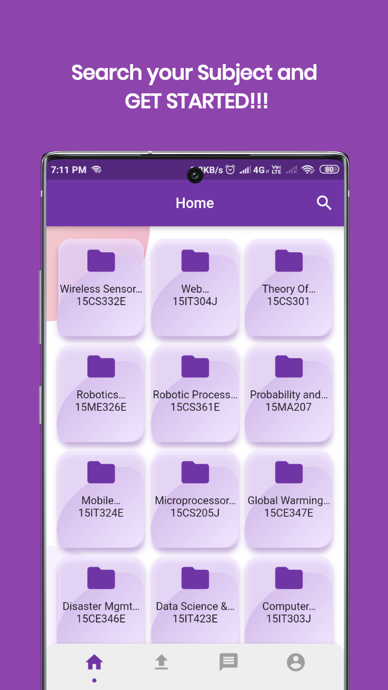
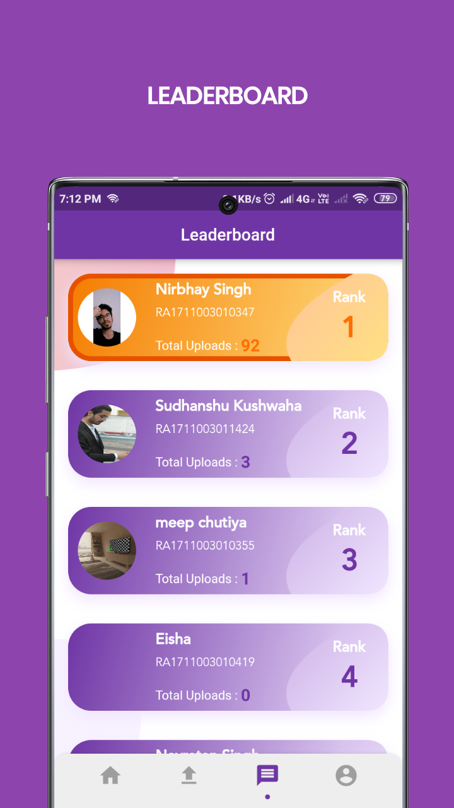
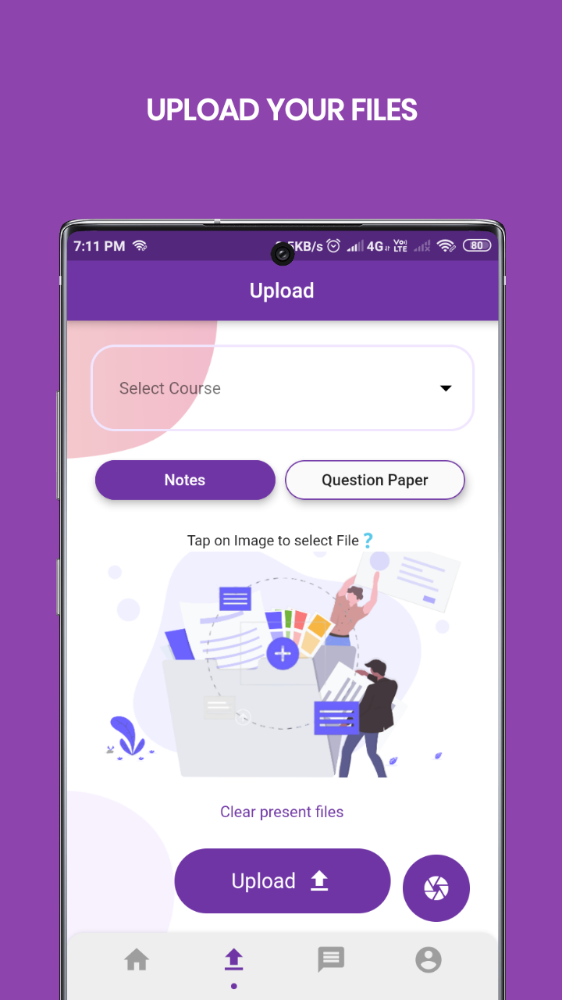
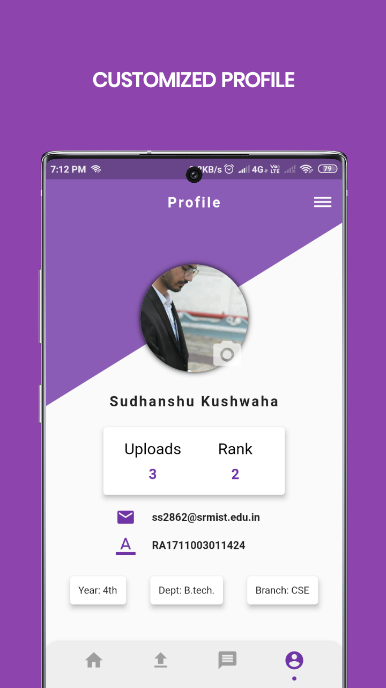

(Android/iOS)

  

<h3 align="center">An Automated Cross-Platform for Documents Sharing</h3>

Features - 

* __Subject Page__ - List of all subjects and their individual document page.

* __Upload Document__ - It is the USP(Unique Selling Point) of the App in which user can itself add the documents for others.

* __Leaderboard__ - An automatic leaderboard generator which shows the ranks of users who with highest document uploader.

* __Profile Page__ - A personalised profile page for the user.

The app has __Feedback Feature and Report Feature__ to report unwanted documents.

---

### How to use the App   

1. Share the content with Srmites.  
2. Quick access to notes and previous year papers.  
3. Quick upload of the first half papers.  
4. Manage your downloaded notes and question papers in your file.  
5. Upload more genuine docs to have your profile showcased on top of the leaderboard.    

---

## Screenshots

